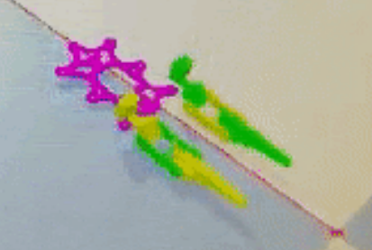
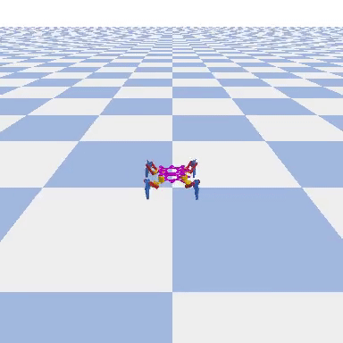
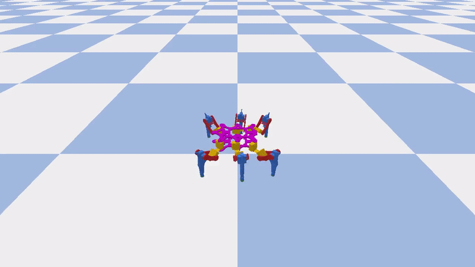
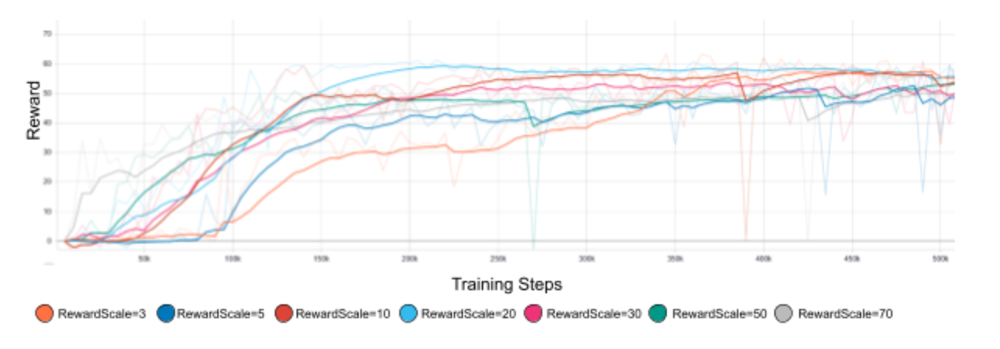
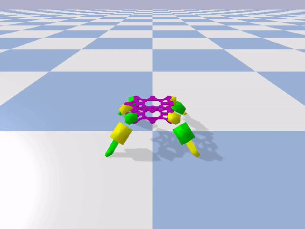
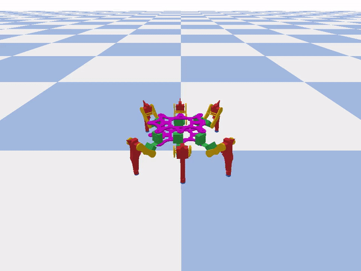

# Spider-Robot

The goal of the project was to let a spider-like-robot teach itself to walk.

The Robot  |   The Robot
:-------------------------:|:-------------------------:
|||

Among other things, a 3D model is needed to simulate the robot. Since no model of the robot was available, this was created with the help of Blender and SketchUp. Credits to [Vincent Musch](https://github.com/vimusc).

|3D-Model | 
|:--:|
||

## Training

PyBullet, a Python module for simulating robots and games, was used for the simulation. PyBullet is based on the Bullet physics engine. In addition, the simulation was built to represent an OpenAI gym environment. Machine learning is to be used to train the robot. The goal of the training is for the robot to learn a walking pattern on its own. The recognition of obstacles and subsequent avoidance, adaptation to environmental conditions such as friction and inclination as well as pathfinding were therefore not part of the project. The goal was to find an architecture that quickly delivers the best possible results.

### Reinforcement Learning

At the beginning, the complexity of the simulation was reduced to 2 legs. In addition, only 2 motors were active per leg.
This version of the simulation was only used with the Q-learning approach and should provide faster results by reducing the complexity. With this simulation the interaction between simulation and AI should be tested: Are actions passed correctly? Are the parameters of the observation correct? etc.

After the interaction between AI and simulation worked and the first positive rewards were achieved, the complexity of the robot was further increased. So now 4 legs with 3 motors each were used.

In the next simulation version, the robot still had 4 legs with 3 motors each. However, many features of the robot were optimized. For example, a more detailed 3D model, better friction values, optimized action space and new reward functions. The reward function will be discussed in more detail in an extra chapter.
This version of the simulation was used with Soft Actor Critic networks.

The final version of the simulation consists of a robot with 6 legs with 3 motors each. To keep the complexity of the whole robot low, the actionspace was further adapted. A single action can now address multiple motors of the robot. This version of the simulation was used exclusively with the final Soft Actor Critic nets.

#### challenges

As already mentioned, an attempt was first made to train a walking pattern with classical DQN. Despite the still very simple simulation, hardly any good results could be achieved. The following adjustments were experimented with:
- Learning Rate
- Number of fully connected layers and their size
- Dimensions of the LSTM
- A Linear Schedule for epsilon

The Soft Actor Critc (SAC) nets were able to achieve a significant improvement. With SAC, good walking patterns could be learned after a short training time of 1-2 hours. It turned out that, as described in the paper [Soft Actor-Critic](https://arxiv.org/pdf/1801.01290.pdf), the reward scale factor has the greatest influence on the result:

A high Reward Scale allows a positive reward to be achieved very quickly. The smaller the reward scale, the longer the network needs to learn a walking pattern. If the Reward Scale is too small, the network may only learn a local maximum and not find a good walking pattern. The best results were achieved with a Reward Scale between 10 and 20.

### Evolution Strategies

In addition to reinforcement learning, evolution strategies have been used to teach the robot to walk in simulation. OpenAI showed in 2017 in their paper "Evolution Strategies as a Scalable Alternative to Reinforcement Learning" that Evolution Strategies bring some advantages over Reinforcement Learning and are competitive. They work by randomly changing network parameters and trial and error. Thus, there is no need to compute a gradient. Also, the implementation is easier to parallelize.

We used "Parameter-exploring Policy Gradients" (PEPG, 2009) as the method, since it has already been successfully tested for similar problems, e.g., four-legged robots with only two joints each.

[ESTool](https://github.com/hardmaru/estool) was used for the implementation. ESTool implements with the help of OpenAI Gym and PyBullet some different Evolution Strategies, among other things PEPG.
To use ESTool for our own problem we created a new Gym Environment.

#### Experiment 1

In a first experiment a simple Gym Evironment was created and in it robots with only four legs with discrete action space and a population size of 36 were trained for about 4 hours. Here, each of the twelve motors can either not move at all, move backward a small amount, or move forward a small amount per step. The positions of all twelve motors, as well as the height of the body, serve as input. The distance covered in a certain direction is used as the reward. A negative reward is given if the body of the robot is not parallel to the ground (cross product smaller than 0.75).

The following model architecture with tanh as activation function in all planes was used:

The robot has learned to move in a certain direction without falling over, however it is very slow, inefficient and partially runs on its joints.

#### Experiment 2

In a second experiment, the Gym Environment, which was successfully used for Soft Actor Critic nets, was tested (see Reinforcement Learning: Final Version of the Simulation). Only the "Energy reward" was deactivated to focus more on the distance traveled and a different render function was used to render the environment also with ESTool.
The same model architecture as in Experiment 1 was used, but with 21 neurons in the input layer (18 motor positions and x, y, and z rotation of the robot) and 12 neurons in the output layer. 
Continuous compressed action space and combined reward function gave better result than Experiment 1, but parameter-exploring policy gradients seems inferior to soft actor critical networks. No significant change could be observed by changing the learning rate and population size:

## Application to the real robot

The simulation seems to represent the real robot well. The real walking pattern looks quite similar to the simulation. Although noise was used in the motor actions in the simulation, it is important to use a rough surface so that the robot has enough grip.
By default, the simulation was called ~24 times for each step(), simulating ~0.1 seconds. However, the hardware setup only allows to execute a step two maximum times per second. A noticeably better result for the real robot could be achieved by training in a simulation with 240 steps, i.e. one second instead of 0.1 seconds per action. 
The network outputs in the simulation were stored in csv files and smoothed if the step frequency of the simulation was greater than that of the real model. The network outputs were then converted to angles and sent to the real robot serially.

The walking Robot  |   The walking Robot
:-------------------------:|:-------------------------:
|||

It is possible to read out the sensor data via the interface. Theoretically, it is therefore possible to continue training on the real model with small restrictions in the reward function. However, since a cycle (sending command and receiving sensor data) takes about two seconds, it would be very time consuming.

